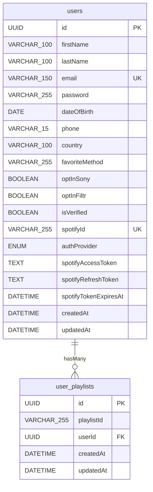

# PROJECT TECHNICAL REPORT — Somos Filtr
**Fecha:** 2026-06-20
**Proposito:** Documentacion tecnica para migracion a plataforma administrada por Sony Music
**Analizado por:** Claude Code Agent (claude-sonnet-4-6)

> NOTA DE SEGURIDAD: Este reporte NO incluye secretos reales, tokens, contrasenas, ni URLs de produccion. Solo se listan nombres de variables de entorno y su proposito funcional.

---

# 1. Resumen ejecutivo

## Proposito del proyecto
Somos Filtr es una plataforma digital de musica dirigida al mercado de Centroamerica y el Caribe, operada bajo la marca Sony Music. Permite a usuarios registrarse, descubrir playlists curadas por genero y mood, guardar playlists como favoritas, conectar su cuenta de Spotify, ver shows de artistas y participar en quizzes y concursos.

## Estado actual
El proyecto esta en produccion activa en la rama `devel`. Hay cambios no commiteados en `backend/index.js` al momento del analisis. El sistema esta desplegado como un contenedor Docker sobre infraestructura DeSMan (plataforma de Sony Music / SME).

## Componentes principales
1. **Backend:** API REST Node.js + Express (CommonJS), Sequelize ORM, MySQL
2. **Frontend:** SPA React 18 + Vite 6 + Tailwind CSS 4
3. **Base de datos:** MySQL con dos tablas (users, user_playlists)
4. **Infraestructura:** Docker, Nginx (proxy), DeSMan hosting
5. **Integraciones externas:** Spotify API, SendGrid, Sony Music Fans (SMF), Bandsintown, CMS externo (Strapi), Google Tag Manager, Hotjar, Wyng

## Descripcion breve del flujo completo
El usuario visita el sitio (dominio en produccion). El navegador carga la SPA React servida por el backend Node.js desde `frontend/dist`. El frontend consume su propia API REST (`/auth`, `/users`, `/api`). La base de datos MySQL almacena usuarios y sus playlists favoritas. Spotify proporciona cobertura de imagenes y la funcionalidad de seguir playlists. SendGrid envia correos de verificacion y recuperacion de contrasena. SMF recibe datos de opt-in de los usuarios en el momento del registro. Bandsintown y el CMS externo proporcionan contenido dinamico de shows, banners, generos y moods.

## Relacion frontend - backend - base de datos
- Frontend (React SPA) --> HTTP/REST --> Backend (Express API) --> Sequelize ORM --> MySQL
- Backend sirve estaticos de `frontend/dist` directamente
- Autenticacion: JWT en header `Authorization: Bearer <token>`, almacenado en `localStorage` del navegador

---

# 2. Estructura del proyecto

## Arbol resumido

```
filtr-frontend-backend/
├── backend/
│   ├── index.js                  # Entry point, arranca servidor Express
│   ├── package.json
│   └── src/
│       ├── app.js                # Config Express, middlewares, rutas, static files
│       ├── config/
│       │   ├── database.js       # Config Sequelize + MySQL
│       │   ├── storage.js        # Config AWS S3 / OBS
│       │   └── swagger.js        # Documentacion OpenAPI
│       ├── controllers/
│       │   ├── auth.controller.js
│       │   ├── user.controller.js
│       │   ├── playlist.controller.js
│       │   └── spotify.controller.js
│       ├── middleware/
│       │   ├── auth.middleware.js
│       │   ├── error.middleware.js
│       │   └── validate.middleware.js
│       ├── models/
│       │   ├── index.js           # Carga y sincroniza modelos
│       │   ├── user.model.js
│       │   └── userPlaylist.model.js
│       ├── routes/
│       │   ├── auth.routes.js
│       │   ├── user.routes.js
│       │   ├── playlist.routes.js
│       │   └── spotify.routes.js
│       ├── utils/
│       │   ├── email.js           # SendGrid
│       │   └── smf.js             # Utilidades SMF (validacion de region)
│       ├── data/
│       │   └── playlists.json     # Catalogo estatico de playlists
│       └── public/
│           └── images/            # Imagenes para emails
├── frontend/
│   ├── index.html
│   ├── package.json
│   ├── vite.config.js
│   └── src/
│       ├── main.jsx               # Entry point React
│       ├── App.jsx                # RouterProvider
│       ├── api/
│       │   ├── backendApi.js      # Cliente Axios principal
│       │   ├── bandsintown.js     # API Bandsintown
│       │   ├── fetchPlaylists.js  # Orquesta fetch + favoritos
│       │   └── fetchStrapiCMS.js  # API CMS externo (Strapi)
│       ├── components/
│       ├── context/
│       ├── hooks/
│       ├── pages/
│       ├── router/
│       └── data/
│           └── playlists.json     # Copia del catalogo para frontend
├── config/
│   └── nginx.conf                 # Config Nginx (WordPress legacy)
├── Dockerfile                     # Build Node.js 20
├── CLAUDE.md
├── AGENTS.md
├── README.md                      # Documentacion DeSMan/Docker
└── backend/env / frontend/env     # Variables de entorno locales
```

## Proposito de cada carpeta principal
- `backend/src/config/`: Configuraciones de BD, storage S3 y Swagger
- `backend/src/controllers/`: Logica de negocio por dominio
- `backend/src/middleware/`: Autenticacion JWT, validacion y errores
- `backend/src/models/`: Modelos Sequelize (ORM)
- `backend/src/routes/`: Definicion de endpoints y validaciones de entrada
- `backend/src/utils/`: Utilidades transversales (email, region)
- `backend/src/data/`: Catalogo estatico de playlists en JSON
- `frontend/src/api/`: Clientes HTTP hacia backend y servicios externos
- `frontend/src/components/`: Componentes React reutilizables
- `frontend/src/context/`: Contextos globales (playlists, GTM, busqueda)
- `frontend/src/hooks/`: Custom hooks de datos
- `frontend/src/pages/`: Paginas de la SPA
- `frontend/src/router/`: Configuracion de rutas y logica de region
- `config/`: Configuracion Nginx legacy (WordPress)
- `.desman/`, `cron.d/`, `extras/`, `plugins/`, `themes/`: Activos de la plataforma DeSMan/WordPress (no tocar)

## Archivos de entrada principales
- Backend: `backend/index.js`
- Frontend: `frontend/src/main.jsx`
- Express app: `backend/src/app.js`
- Rutas React: `frontend/src/router/routes.jsx`

## Archivos de configuracion relevantes
- `backend/src/config/database.js` (Confirmado)
- `backend/src/config/storage.js` (Confirmado)
- `backend/env` (variables de entorno locales backend)
- `frontend/env` (variables de entorno locales frontend)
- `Dockerfile` (build Node.js 20)
- `config/nginx.conf` (Nginx legacy WordPress)

---

# 3. Arquitectura general

## Diagrama textual

```
[Navegador]
     |
     | HTTPS
     v
[Nginx] (proxy, SSL termination, DeSMan)
     |
     | HTTP (puerto 80)
     v
[Node.js / Express - backend/index.js]
     |
     |-- /api-docs   --> Swagger UI
     |-- /auth       --> auth.routes.js --> auth.controller.js
     |-- /users      --> user.routes.js  --> user.controller.js
     |-- /users      --> playlist.routes.js --> playlist.controller.js
     |-- /api        --> spotify.routes.js  --> spotify.controller.js
     |-- /*          --> frontend/dist/index.html (SPA fallback)
     |
     |-- Sequelize ORM --> MySQL (DESMAN_DB_*)
     |-- @sendgrid/mail --> SendGrid API
     |-- axios --> Spotify API (accounts.spotify.com, api.spotify.com)
     |-- SMF submit (subs.sonymusicfans.com) [via smf.js - solo validacion local, submit real via SMF_SUBMIT_URL]

[React SPA en frontend/dist]
     |
     |-- axios --> VITE_API_URL (propio backend Express)
     |-- fetch  --> VITE_CMS_URL (CMS externo Strapi)
     |-- fetch  --> rest.bandsintown.com
     |-- react-gtm-module --> GTM (Google Tag Manager ID: GTM-NW2SVN5N)
```

## Flujo de una peticion tipica

1. Navegador solicita `https://www.somosfiltr.com/cr`
2. Nginx recibe y proxy-pasa a Node.js en el puerto 80
3. Node.js sirve `frontend/dist/index.html` (SPA fallback)
4. React Router detecta region `/cr` y carga `RegionLayout`
5. `PlaylistContext` llama a `fetchAllPlaylists()` --> `GET /api/playlists`
6. Backend lee `playlists.json`, consulta Spotify API (cache 24h), responde
7. React renderiza playlists filtradas por region

## Como el backend sirve el frontend en produccion
Confirmado en `backend/src/app.js` lineas 59-63:
```js
app.use(express.static(path.join(__dirname, '../../frontend/dist')));
app.get(/^\/(?!api|auth|users).*/, (req, res) => {
  res.sendFile(path.join(__dirname, '../../frontend/dist/index.html'));
});
```
- Rutas que NO empiezan con `/api`, `/auth`, `/users` reciben `index.html`
- React Router maneja la navegacion en cliente

## Nginx y process manager
- **Nginx**: Confirmado en `config/nginx.conf`. Es un proxy configurado para WordPress (php-fpm), NO para Node.js directamente. En produccion, DeSMan maneja el proxy hacia Node.
- **Docker**: Confirmado. `Dockerfile` usa `node:20`, expone puerto 80, ejecuta `node index.js`
- **PM2**: No encontrado en el codigo
- **Process manager en Docker**: El proceso principal es `node index.js` directo (sin PM2)

---

# 4. Frontend

## Framework, version, lenguaje
- **Framework**: React 18.3.1
- **Build tool**: Vite 6.0.5
- **Lenguaje**: JavaScript (JSX), ES Modules (`"type": "module"` en package.json)
- **Estilos**: Tailwind CSS 4.0.0 (via `@tailwindcss/vite`)

## Librerias principales

| Libreria | Version | Proposito | Ubicacion/Uso principal | Criticidad |
|---|---|---|---|---|
| react | ^18.3.1 | UI framework | Toda la app | Critica |
| react-dom | ^18.3.1 | DOM rendering | main.jsx | Critica |
| react-router-dom | ^7.6.0 | Routing SPA + region | router/routes.jsx | Critica |
| axios | ^1.9.0 | HTTP client backend | api/backendApi.js | Critica |
| tailwindcss | ^4.0.0 | Estilos utilitarios | index.css, todos los componentes | Critica |
| jwt-decode | ^4.0.0 | Decode JWT en cliente | LoginForm, SignUpForm | Alta |
| react-gtm-module | ^2.0.11 | Google Tag Manager | context/GTMContext.jsx | Alta |
| react-helmet-async | ^2.0.5 | SEO meta tags | router/RegionLayout.jsx | Media |
| react-icons | ^5.4.0 | Iconos UI | Formularios, nav | Media |
| react-responsive-carousel | ^3.2.23 | Carrusel home | components/home/HeaderCarousel.jsx | Media |
| react-spinners | ^0.17.0 | Loading states | Formularios | Baja |
| flag-icons | ^7.5.0 | Banderas de paises | main.jsx, CountryPicker | Baja |
| @tailwindcss/line-clamp | ^0.4.4 | Text clamp | PlaylistCard | Baja |
| sitemap | ^8.0.0 | Sitemap generacion | Inferido, no encontrado en uso activo | Baja |
| dotenv | ^16.4.7 | Variables entorno | No necesario en Vite (usa import.meta.env) | Baja |

## Sistema de estilos
- Tailwind CSS 4 con plugin `@tailwindcss/vite` (integracion nativa en Vite)
- Colores de marca: `#131517` (fondo oscuro), `#ca249c` (magenta principal), `#CFDD28` (amarillo acento)
- Responsive: clases `md:` para breakpoint desktop
- No hay archivo `tailwind.config.js` (Tailwind 4 no lo requiere)

## Routing
- `react-router-dom` v7.6.0 con `createBrowserRouter`
- Sistema de region en la URL: `/:region/[subruta]`
- Regiones activas: `cr` (Costa Rica), `do` (Republica Dominicana), `pa` (Panama) — definido en `frontend/src/router/routes.jsx` linea 21
- Regiones definidas en backend/utils/smf.js: `cr, do, pa, gt, sv, us` (6 regiones, mas amplio que el frontend)
- La raiz `/` redirige a `/cr` por defecto
- Fallback `*` tambien redirige a region preferida o `/cr`
- Deteccion automatica de region via GeoIP (archivo `frontend/src/utils/geo.js` — no leido, importado dinamicamente)

## Manejo de estado
- **PlaylistContext**: estado global de playlists (cargadas del backend, filtradas por region)
- **SearchContext**: busqueda activa en toda la app
- **GTMContext**: eventos Google Tag Manager
- **RegionContext**: region activa del usuario
- No hay Redux, Zustand ni otra libreria de estado global
- Estado local con `useState` en cada componente de formulario

## Consumo de APIs
- `frontend/src/api/backendApi.js`: cliente Axios con `VITE_API_URL` como baseURL, interceptor que agrega `Authorization: Bearer <token>` desde `localStorage`
- `frontend/src/api/fetchStrapiCMS.js`: fetch directo a `VITE_CMS_URL` con `VITE_CMS_TOKEN` en header
- `frontend/src/api/bandsintown.js`: fetch a `rest.bandsintown.com` con `VITE_BANDSINTOWN_APP_ID` y parametros UTM
- `frontend/src/api/fetchPlaylists.js`: orquesta llamada a `/api/playlists` y merge con favoritos del usuario

## Autenticacion en el frontend
- Token JWT almacenado en `localStorage` bajo la clave `"token"`
- Usuario almacenado en `localStorage` bajo la clave `"user"` (JSON serializado)
- El token se envia como `Authorization` header en todas las peticiones via interceptor Axios
- Preferencia de region en `localStorage` bajo clave `"filtr_region"`
- El token se decodifica en cliente (sin verificacion criptografica) para extraer el email del payload en flujos Spotify

## Estructura de componentes

```
components/
├── explore/           # Listas de generos, moods, shows, quizzes, iframes
├── filter/            # Resultados de busqueda
├── genres/            # Header de la pagina Generos
├── home/              # Carrusel y preview de categorias
├── moods/             # Header de la pagina Moods
├── prizes/            # Header de premios
├── quizzes/           # Componente de quiz
├── shows/             # Cards y header de shows
├── trending/          # Cards de playlists trending
└── ui/
    ├── forms/         # LoginForm, SignUpForm, EditAccountForm, ForgotPasswordForm, ResetPasswordForm
    ├── modal/         # LoginModal, ProfileModal, SpotifyModals, ShareModal, DeleteAccountModal, CookieConsentBanner, ExternalLinkModal
    ├── navMenu/       # NavMenu, MobileMenu, NavMenuItem
    ├── PlaylistCard.jsx
    ├── PlaylistsContainerGrid.jsx
    ├── SearchResults.jsx
    ├── PageHeader.jsx
    ├── Footer.jsx
    ├── MusicBanner.jsx
    └── CountryPicker.jsx
```

## Paginas principales

| Pagina | Ruta | Descripcion |
|---|---|---|
| Home | `/:region` | Listado de playlists por categoria, carrusel |
| Genres | `/:region/genres` | Explorar por genero musical |
| Moods | `/:region/moods` | Explorar por mood/estado de animo |
| Quizzes | `/:region/quizzes` | Quizzes interactivos |
| Shows | `/:region/shows` | Shows de artistas |
| Trending | `/:region/trending` | Playlists trending |
| Prizes | `/:region/prizes` | Concursos y premios |
| Login | `/:region/login` | Inicio de sesion |
| SignUp | `/:region/signup` | Registro de nuevo usuario |
| EditAccount | `/:region/edit-account` | Editar perfil y contrasena |
| FavoritePlaylists | `/:region/favorite-playlists` | Playlists guardadas |
| VerifyEmail | `/:region/verify-email` | Confirmacion de email |
| ForgotPassword | `/:region/forgot-password` | Recuperacion de contrasena |
| ResetPassword | `/:region/reset-password` | Reset de contrasena |
| TermsAndConditions | `/:region/terms-and-conditions` | Terminos legales |
| PrivacyPolicy | `/:region/privacy-policy` | Politica de privacidad |

## Formularios y validaciones
- **SignUpForm**: 2 etapas. Paso 1: email + contrasena. Paso 2: nombre, apellido, pais, fecha nacimiento, telefono, metodo de escucha, opt-ins Sony/Filtr, aceptacion politica de privacidad
- **LoginForm**: email + contrasena. Soporte flujo Spotify (token en URL)
- **EditAccountForm**: campos de perfil + cambio de contrasena
- **ForgotPasswordForm**: solo email
- **ResetPasswordForm**: nueva contrasena con token de URL
- Validaciones en cliente: regex email, regex contrasena fuerte (`/(?=.*[a-z])(?=.*[A-Z])(?=.*\d)(?=.*\W).{6,}/`), campos requeridos, longitud de telefono
- Validaciones duplicadas en el servidor con `express-validator`

## Build de produccion
- Comando: `npm run build` en `frontend/`
- Output: `frontend/dist/`
- El backend sirve `frontend/dist` como estaticos y `frontend/dist/index.html` como SPA fallback

## Variables de entorno del frontend (Vite)

| Variable | Proposito |
|---|---|
| VITE_API_URL | URL base del backend Express |
| VITE_CMS_URL | URL del CMS externo (Strapi) |
| VITE_CMS_TOKEN | Token de autenticacion del CMS |
| VITE_BANDSINTOWN_APP_ID | App ID para API de Bandsintown |
| VITE_UTM_SOURCE | Tracking UTM source |
| VITE_UTM_MEDIUM | Tracking UTM medium |
| VITE_UTM_CAMPAIGN | Tracking UTM campaign |
| VITE_SPOTIFY_CLIENT_ID | Client ID de Spotify (presente en env pero puede no ser necesario en frontend) |
| VITE_SPOTIFY_CLIENT_SECRET | Client Secret de Spotify en frontend (RIESGO DE SEGURIDAD — ver seccion 20) |
| VITE_SPOTIFY_REDIRECT_URI | URI de redirect OAuth Spotify (en env local) |

## Problemas potenciales / Deuda tecnica
1. `VITE_SPOTIFY_CLIENT_SECRET` presente en `frontend/env` — un secret de Spotify expuesto en el bundle del cliente es un riesgo de seguridad alto. En produccion, confirmar que esta variable NO se include en el build.
2. `dotenv` listado como dependencia del frontend pero Vite no usa dotenv (usa `import.meta.env`). Es dependencia innecesaria.
3. La libreria `sitemap` esta en dependencias pero no se encontro uso activo en el codigo leido.
4. El token JWT se decodifica en cliente sin verificacion criptografica (solo para extraer email). Es un patron aceptable pero debe documentarse.
5. `localStorage` para JWT: expuesto a XSS. No hay proteccion de httpOnly cookies.
6. Version de React Router v7 (relativamente nueva) — verificar compatibilidad de plugins y documentacion.
7. Regiones en `routes.jsx` son 3 (`cr, do, pa`) pero `smf.js` soporta 6 (`cr, do, pa, gt, sv, us`). Inconsistencia.

---

# 5. Backend custom

## Runtime, framework y versiones

- **Runtime**: Node.js 20 (confirmado en Dockerfile)
- **Framework**: Express 5.1.0 (version mayor — Express 5 tiene cambios de compatibilidad respecto a Express 4)
- **Modulo**: CommonJS (`require/module.exports`)
- **Puerto**: `process.env.PORT || 80`

## Estructura de rutas, controladores, servicios y modelos

```
Rutas                    Controladores              Modelos
/auth        ---------> auth.controller.js  ------> User
/users       ---------> user.controller.js  ------> User
/users       ---------> playlist.controller.js ---> User, UserPlaylist
/api         ---------> spotify.controller.js ----> User (para token Spotify)
```

No existe capa de servicios separada. La logica de negocio esta directamente en los controladores.

## Autenticacion y autorizacion

### JWT
- Libreria: `jsonwebtoken` 9.0.2
- Secret: `process.env.JWT_SECRET`
- Expiracion de sesion: `process.env.JWT_EXPIRES_IN` (por defecto `7d` segun `backend/env`)
- Algoritmo: Por defecto HS256
- Formato en headers: `Authorization: Bearer <token>`
- Tipos de token:
  - Sesion normal: `{ id, email, iat, exp }`
  - Verificacion de email: `{ userId, type: "emailVerify" }`, expira segun `EMAIL_TOKEN_EXPIRES_IN` (24h)
  - Reset de contrasena: `{ userId, type: "passwordReset" }`, expira en 1h
  - Temporal Spotify signup: `{ id, provider: "spotify", step: "signup", email }`, expira en 15m
  - Conexion Spotify desde perfil: `{ type: "spotify-connect", userId, returnUrl }`, expira en 15m

### Middleware de autenticacion
Archivo: `backend/src/middleware/auth.middleware.js`
- Funcion `protect(req, res, next)`: verifica `Authorization: Bearer <token>`, decodifica JWT, inyecta `req.user = { id, email, iat, exp }`
- Retorna 401 si no hay header o token invalido

### Proteccion de rutas
- `/users` y `/users/:userId/playlists/*`: `router.use(protect)` — TODAS las rutas protegidas
- `/auth/*`: publicas (registro, login, verificacion, reset)
- `/api/playlists`: publica (no requiere auth)
- `/api-docs`: Swagger UI, publico

## Registro y login de usuarios

### Registro normal
1. Validacion con express-validator
2. Verificar que email no exista en DB
3. Hash de contrasena con bcryptjs (salt 12)
4. Crear usuario con `isVerified: false`
5. Enviar datos a SMF (`submitSignupToSmf`)
6. Generar token de verificacion JWT
7. Enviar email con SendGrid
8. Responder 201 con mensaje "revisa tu correo"

### Registro via Spotify
1. Flujo OAuth: `/auth/spotify/login` --> redirige a Spotify
2. Callback `/auth/spotify/callback`: intercambia code por tokens
3. Obtiene perfil de Spotify
4. Si usuario existe: actualiza tokens, genera token de sesion, redirige a `/login?token=...`
5. Si NO existe: crea usuario (isVerified: true, password: "SPOTIFY_ACCOUNT"), genera token temporal 15m, redirige a `/signup?spotifyToken=...`
6. En `/signup` el usuario completa datos faltantes, el token temporal se usa para identificarlo

### Login normal
1. Busca usuario por email
2. Verifica contrasena con `bcrypt.compare`
3. Verifica `isVerified === true`
4. Genera JWT de sesion
5. Responde `{ token, user }` (sin password)

### Login via Spotify
1. Recibe `spotifyToken` en body
2. Verifica JWT temporal
3. Busca usuario por `id` del token
4. Genera JWT de sesion nueva

## Gestion de usuarios

- `GET /users`: lista todos (protegido). RIESGO: cualquier usuario autenticado puede listar todos los usuarios.
- `GET /users/:id`: obtiene por ID (protegido)
- `PUT /users/:id`: actualiza campos permitidos + cambio de contrasena (protegido)
- `DELETE /users/:id`: elimina usuario (protegido). Sin verificar que el usuario autenticado sea el mismo.

## Favoritos de playlists

- `GET /users/:userId/playlists`: lista favoritos
- `POST /users/:userId/playlists`: agrega favorito
- `DELETE /users/:userId/playlists/:playlistId`: elimina favorito
- `POST /users/:userId/spotify/playlists/follow`: sigue en Spotify
- `POST /users/:userId/spotify/playlists/unfollow`: deja de seguir en Spotify
- Solo almacena `playlistId` (string del ID de Spotify) + `userId` + timestamps

## Integracion con Spotify

### Flujo OAuth (auth.controller.js)
- Scopes: `user-read-email user-read-private playlist-modify-public`
- Client credentials para playlist updates
- Refresh automatico de access_token cuando expira (playlist.controller.js)
- Conexion/desconexion de Spotify desde perfil de usuario
- Tokens almacenados en BD: `spotifyAccessToken`, `spotifyRefreshToken`, `spotifyTokenExpiresAt`

### Playlist info (spotify.controller.js)
- Client Credentials flow para leer info publica de playlists
- Cache en memoria: 24h TTL
- Retry en error 429 (rate limit) con backoff de 1 segundo

## Integracion con SendGrid

- Libreria: `@sendgrid/mail` 8.1.5
- Dos emails: verificacion de cuenta, reset de contrasena
- Imagenes inline como attachments base64 (CID)
- Remitente: `no-reply@somosfiltr.com` (variable `SENDGRID_FROM_EMAIL`)
- Variables: `SENDGRID_API_KEY`, `SENDGRID_FROM_EMAIL`, `FRONTEND_BASE_URL`

## Integracion con SMF (Sony Music Fans)

Archivo: `backend/src/utils/smf.js`
- NOTA: El archivo actual (`smf.js`) solo contiene funciones de validacion de region (`REGIONS`, `normalizeRegion`, `isValidRegion`, `coerceRegion`). NO contiene la implementacion real del submit a SMF.
- La funcion `submitSignupToSmf` es importada en `auth.controller.js` desde `../utils/smf`, pero NO esta implementada en el archivo actual.
- INCONSISTENCIA: `auth.controller.js` importa `submitSignupToSmf` de `smf.js`, pero `smf.js` no exporta esa funcion.
- Inferido: La implementacion real de SMF debio existir anteriormente o puede estar en el backend en produccion con una version diferente del archivo. Las variables de entorno para SMF estan definidas: `SMF_SUBMIT_URL`, `SMF_AE_API_KEY`, `SMF_AE_BRAND_ID`, `SMF_AE_SEGMENT_ID`, `SMF_FORM_ID`, `SMF_LIST_ID_SONY`, `SMF_LIST_ID_FILTR`.

## Integracion con Salesforce Marketing Cloud

- No encontrado en el codigo del backend ni frontend.
- Las variables de entorno `SMF_*` corresponden a Sony Music Fans, no a Salesforce Marketing Cloud directamente.

## Validaciones, manejo de errores, CORS, logging, seguridad

- **Validaciones**: `express-validator` 7.2.1 con middleware `validateRequest`
- **Manejo de errores**: Middleware centralizado `errorHandler` (500) y `notFound` (404)
- **CORS**: `cors()` sin configuracion especifica — permite TODOS los origenes. RIESGO DE SEGURIDAD.
- **Logging**: `morgan("dev")` para logging HTTP en desarrollo
- **Seguridad HTTP**: `helmet()` 8.1.0 con configuracion por defecto
- **CSP**: Content-Security-Policy configurado manualmente en `app.js` con lista blanca de dominios (admin.somosfiltr.com, Spotify, GTM, Hotjar, Wyng, Bandsintown, Google Analytics)
- **SQL Injection**: Protegido por Sequelize ORM con queries parametrizadas
- **Rate limiting**: No encontrado. Solo hay retry manual en Spotify 429.

## Variables de entorno del backend

| Variable | Proposito |
|---|---|
| PORT | Puerto del servidor (default 80) |
| NODE_ENV | Ambiente (development/production) |
| JWT_SECRET | Secreto para firmar/verificar JWT |
| JWT_EXPIRES_IN | Expiracion del token de sesion |
| EMAIL_TOKEN_EXPIRES_IN | Expiracion tokens de email (24h) |
| DESMAN_DB_PORT_3306_TCP_ADDR | Host MySQL |
| DESMAN_DB_PORT_3306_TCP_PORT | Puerto MySQL (3306) |
| DESMAN_DB_ENV_MYSQL_USER | Usuario MySQL |
| DESMAN_DB_ENV_MYSQL_PASSWORD | Contrasena MySQL |
| DESMAN_DB_ENV_MYSQL_DATABASE | Nombre de la base de datos |
| DESMAN_OBS_KEY_ID | Access Key S3/OBS |
| DESMAN_OBS_KEY_SECRET | Secret Key S3/OBS |
| DESMAN_OBS_EXT_URL | Endpoint S3/OBS externo |
| DESMAN_OBS_BASE_URL | URL base S3 |
| DESMAN_OBS_BUCKET | Nombre del bucket |
| DESMAN_OBS_PREFIX | Prefijo de rutas en el bucket |
| DESMAN_OBS_REGION | Region S3 (eu-central-1) |
| DESMAN_OBS_SIGNATURE | Version de firma (v4) |
| DESMAN_OBS_PATH_MODE | Modo de path S3 |
| SENDGRID_API_KEY | API Key de SendGrid |
| SENDGRID_FROM_EMAIL | Email remitente (no-reply@somosfiltr.com) |
| FRONTEND_BASE_URL | URL base del frontend (para links en emails) |
| SPOTIFY_CLIENT_ID | Client ID Spotify OAuth |
| SPOTIFY_CLIENT_SECRET | Client Secret Spotify OAuth |
| SPOTIFY_REDIRECT_URI | URI callback OAuth Spotify |
| SMF_SUBMIT_URL | URL endpoint Sony Music Fans |
| SMF_AE_API_KEY | API Key Sony Music Fans |
| SMF_AE_BRAND_ID | Brand ID Sony Music Fans |
| SMF_AE_SEGMENT_ID | Segment ID Sony Music Fans |
| SMF_FORM_ID | Form ID Sony Music Fans |
| SMF_LIST_ID_SONY | ID lista mailing Sony |
| SMF_LIST_ID_FILTR | ID lista mailing Filtr |

## Proceso de arranque
1. `node index.js` (o `nodemon index.js` en dev)
2. Express app importa `./src/app.js`
3. `app.js` importa `./models` que ejecuta `sequelize.sync({ alter: NODE_ENV === "development" })`
4. La BD se sincroniza automaticamente al arranque
5. Servidor escucha en PORT

## Como sirve el build del frontend
- `express.static(path.join(__dirname, '../../frontend/dist'))`: sirve estaticos
- Regex `app.get(/^\/(?!api|auth|users).*/, ...)`: envia `index.html` para rutas SPA

## Tabla de endpoints

| Metodo | Ruta | Proposito | Auth | Request | Response | Controlador |
|---|---|---|---|---|---|---|
| POST | /auth/register | Registrar usuario | No | firstName, lastName, email, password, dateOfBirth, phone, country, [favoriteMethod, optInSony, optInFiltr, spotifyToken] | 201 {message} o {token, user} | auth.controller.js#register |
| POST | /auth/login | Iniciar sesion | No | email, password o {email, spotifyToken} | 200 {token, user} | auth.controller.js#login |
| POST | /auth/logout | Cerrar sesion | No | - | 200 {message} | auth.controller.js#logout |
| GET | /auth/confirm | Verificar email | No | ?token=JWT | 200 {message, token, user} | auth.controller.js#confirmEmail |
| POST | /auth/resend-verification | Reenviar verificacion | No | {email} | 200 {message} | auth.controller.js#resendVerification |
| POST | /auth/forgot-password | Solicitar reset | No | {email} | 200 {message} | auth.controller.js#forgotPassword |
| POST | /auth/reset-password | Resetear contrasena | No | {token, newPassword} | 200 {message, token, user} | auth.controller.js#resetPassword |
| GET | /auth/spotify/login | Iniciar OAuth Spotify | No | - | 302 redirect Spotify | auth.controller.js#spotifyLogin |
| GET | /auth/spotify/callback | Callback OAuth Spotify | No | ?code=&state= | 302 redirect frontend | auth.controller.js#spotifyCallback |
| GET | /users | Listar usuarios | Si (JWT) | - | 200 [User] | user.controller.js#getAll |
| GET | /users/:id | Obtener usuario | Si (JWT) | - | 200 User | user.controller.js#getById |
| PUT | /users/:id | Actualizar usuario | Si (JWT) | campos editables + contrasena | 200 {message} | user.controller.js#update |
| DELETE | /users/:id | Eliminar usuario | Si (JWT) | - | 200 {message} | user.controller.js#delete |
| POST | /users/:id/spotify/connect/start | Iniciar conexion Spotify | Si (JWT, mismo usuario) | {returnUrl} | 200 {url} | user.controller.js#startSpotifyConnect |
| POST | /users/:id/spotify/disconnect | Desconectar Spotify | Si (JWT, mismo usuario) | - | 200 {user} | user.controller.js#disconnectSpotify |
| GET | /users/:userId/playlists | Listar playlists fav | Si (JWT) | - | 200 {playlists} | playlist.controller.js#list |
| POST | /users/:userId/playlists | Agregar playlist fav | Si (JWT) | {playlistId} | 201 {message, id} | playlist.controller.js#add |
| DELETE | /users/:userId/playlists/:playlistId | Eliminar playlist fav | Si (JWT) | - | 200 {message} | playlist.controller.js#remove |
| POST | /users/:userId/spotify/playlists/follow | Seguir playlist en Spotify | Si (JWT, mismo usuario) | {playlistId, spotifyAccessToken, ...} | 200 {message} | playlist.controller.js#followSpotify |
| POST | /users/:userId/spotify/playlists/unfollow | Dejar de seguir en Spotify | Si (JWT, mismo usuario) | {playlistId, ...} | 200 {message} | playlist.controller.js#unfollowSpotify |
| GET | /api/playlists | Obtener playlists con datos Spotify | No | - | 200 {playlists} | spotify.controller.js#getUpdatedPlaylists |
| GET | /api-docs | Swagger UI | No | - | HTML | swagger-ui-express |

---

# 6. Modelos de base de datos

## Modelo User

**Archivo**: `backend/src/models/user.model.js`
**Tabla**: `users`

| Campo | Tipo Sequelize | Tipo SQL | Null | Default | Indice | Unico | FK | Descripcion |
|---|---|---|---|---|---|---|---|---|
| id | UUID | CHAR(36) | No | UUIDV4 | PK | Si | - | Identificador unico (UUID v4) |
| firstName | STRING(100) | VARCHAR(100) | No | - | No | No | - | Nombre |
| lastName | STRING(100) | VARCHAR(100) | No | - | No | No | - | Apellido |
| email | STRING(150) | VARCHAR(150) | No | - | Si | Si | - | Correo electronico, unico |
| password | STRING | VARCHAR(255) | No | - | No | No | - | Hash bcrypt o "SPOTIFY_ACCOUNT" |
| dateOfBirth | DATEONLY | DATE | Si | NULL | No | No | - | Fecha de nacimiento |
| phone | STRING(15) | VARCHAR(15) | Si | NULL | No | No | - | Telefono (solo numeros) |
| country | STRING(100) | VARCHAR(100) | Si | NULL | No | No | - | Pais |
| favoriteMethod | STRING(255) | VARCHAR(255) | Si | NULL | No | No | - | Metodo de escucha musical |
| optInSony | BOOLEAN | TINYINT(1) | No | false | No | No | - | Opt-in comunicaciones Sony |
| optInFiltr | BOOLEAN | TINYINT(1) | No | false | No | No | - | Opt-in comunicaciones Filtr |
| isVerified | BOOLEAN | TINYINT(1) | No | false | No | No | - | Email verificado |
| spotifyId | STRING | VARCHAR(255) | Si | NULL | Si | Si | - | ID Spotify del usuario |
| authProvider | ENUM | ENUM | No | "local" | No | No | - | Proveedor auth: "local" o "spotify" |
| spotifyAccessToken | TEXT | TEXT | Si | NULL | No | No | - | Token de acceso Spotify |
| spotifyRefreshToken | TEXT | TEXT | Si | NULL | No | No | - | Token de refresh Spotify |
| spotifyTokenExpiresAt | DATE | DATETIME | Si | NULL | No | No | - | Expiracion del access token Spotify |
| createdAt | DATE | DATETIME | No | NOW | No | No | - | Timestamp creacion (Sequelize auto) |
| updatedAt | DATE | DATETIME | No | NOW | No | No | - | Timestamp actualizacion (Sequelize auto) |

**Hooks**: Ninguno definido explicitamente
**Timestamps**: true (createdAt, updatedAt automaticos)
**Propósito funcional**: Almacena la cuenta completa del usuario incluyendo credenciales, datos de perfil, preferencias, consentimientos de marketing y tokens de Spotify.

## Modelo UserPlaylist

**Archivo**: `backend/src/models/userPlaylist.model.js`
**Tabla**: `user_playlists`

| Campo | Tipo Sequelize | Tipo SQL | Null | Default | Indice | Unico | FK | Descripcion |
|---|---|---|---|---|---|---|---|---|
| id | UUID | CHAR(36) | No | UUIDV4 | PK | Si | - | Identificador unico |
| playlistId | STRING | VARCHAR(255) | No | - | No | No | - | ID de la playlist en Spotify |
| userId | UUID | CHAR(36) | No | - | Si | No | users.id | FK hacia usuario (cascade delete) |
| createdAt | DATE | DATETIME | No | NOW | No | No | - | Fecha agregado (usada como "addedAt") |
| updatedAt | DATE | DATETIME | No | NOW | No | No | - | Timestamp actualizacion |

**Hooks**: Ninguno
**Timestamps**: true
**Propósito funcional**: Tabla pivot que relaciona usuarios con sus playlists favoritas. Solo almacena el ID de Spotify de la playlist, no los datos completos de la playlist.

## Tabla resumen de modelos

| Modelo | Tabla | Proposito | Relaciones principales | Archivo |
|---|---|---|---|---|
| User | users | Cuenta de usuario completa | hasMany UserPlaylist | backend/src/models/user.model.js |
| UserPlaylist | user_playlists | Playlists favoritas del usuario | belongsTo User | backend/src/models/userPlaylist.model.js |

---

# 7. Relaciones de base de datos

## Relaciones definidas

| Modelo origen | Destino | Tipo | FK | Tabla intermedia | Alias | onDelete | onUpdate | Archivo |
|---|---|---|---|---|---|---|---|---|
| User | UserPlaylist | hasMany | userId | - | - | CASCADE | No definido | userPlaylist.model.js |
| UserPlaylist | User | belongsTo | userId | - | - | (hereda CASCADE) | No definido | userPlaylist.model.js |

## Diagrama textual ERD

```
+------------------+           +-----------------------+
|     users        |           |    user_playlists     |
+------------------+           +-----------------------+
| id (UUID, PK)    |<---+      | id (UUID, PK)         |
| firstName        |    |      | playlistId (STRING)   |
| lastName         |    +------| userId (UUID, FK)     |
| email (UNIQUE)   |           | createdAt             |
| password         |           | updatedAt             |
| dateOfBirth      |           +-----------------------+
| phone            |
| country          |
| favoriteMethod   |
| optInSony        |
| optInFiltr       |
| isVerified       |
| spotifyId (UNIQUE)|
| authProvider     |
| spotifyAccessToken|
| spotifyRefreshToken|
| spotifyTokenExpiresAt|
| createdAt        |
| updatedAt        |
+------------------+
```

---

# 8. Esquema logico de base de datos

## Diagrama Mermaid ERD



---

# 9. Migraciones, seeders y sincronizacion

## Uso de migraciones Sequelize
- **No encontrado**: No existen archivos de migracion en ninguna carpeta `migrations/` o `seeders/`.
- El directorio `backend/src/migrations/` no existe en el repositorio.
- El directorio `backend/src/seeders/` no existe en el repositorio.

## Sincronizacion automatica
Archivo: `backend/src/models/index.js`
```js
sequelize.sync({ alter: process.env.NODE_ENV === "development" })
```
- En **desarrollo** (`NODE_ENV === "development"`): usa `{ alter: true }` — modifica columnas existentes para que coincidan con el modelo
- En **produccion**: usa `sync()` sin opciones — crea tablas si no existen, NO modifica tablas existentes

## Riesgos y recomendaciones

| Riesgo | Nivel | Descripcion |
|---|---|---|
| `alter: true` en desarrollo sobre BD de produccion accidental | Critico | Si `NODE_ENV` no esta correctamente seteado, `alter: true` puede corromper datos |
| Sin historial de cambios | Alto | No hay migraciones versionadas; imposible rollback de esquema |
| `alter: true` puede perder datos | Alto | Sequelize alter puede recrear columnas y perder datos en algunos motores |
| Sin seeders para datos iniciales | Medio | No hay forma reproducible de poblar datos de prueba |

## Recomendaciones
1. Migrar a Sequelize CLI con migraciones versionadas (`sequelize-cli`)
2. Nunca conectar a la BD de produccion con `NODE_ENV=development`
3. Antes de cualquier cambio de esquema, tomar dump completo de la BD
4. Usar `{ force: false }` en produccion (comportamiento actual, pero confirmar)

---

# 10. Datos almacenados

## Datos en base de datos MySQL

### Tabla `users`
- Datos personales: nombre, apellido, email, fecha de nacimiento, telefono, pais
- Credenciales: hash bcrypt de contrasena (salt 12)
- Estado de cuenta: `isVerified`, `authProvider`
- Consentimientos de marketing: `optInSony`, `optInFiltr`
- Preferencias: `favoriteMethod` (plataforma de musica)
- Tokens Spotify en texto plano: `spotifyAccessToken`, `spotifyRefreshToken`, `spotifyTokenExpiresAt`
- Identificador Spotify: `spotifyId`

### Tabla `user_playlists`
- Solo el ID de Spotify de la playlist (`playlistId`)
- Referencia al usuario (`userId`)
- Fecha de agregado (`createdAt`)

## Datos Spotify almacenados localmente
- `spotifyId`: identificador del usuario en Spotify
- `spotifyAccessToken`: token de acceso (sensible, en texto plano en BD)
- `spotifyRefreshToken`: token de refresh (sensible, en texto plano en BD)
- `spotifyTokenExpiresAt`: fecha de expiracion

## Datos enviados a servicios externos
- **SMF (Sony Music Fans)**: firstName, lastName, email, dateOfBirth, phone, country, favoriteMethod, optInSony, optInFiltr — enviados en el momento del registro
- **SendGrid**: email del destinatario, nombre (para verificacion), token JWT en URL
- **Google Tag Manager**: eventos de navegacion, region, page_view, consent_update
- **Hotjar**: sesiones de usuario (script de analytics)
- **Bandsintown**: app_id, nombre de artista (consultas publicas)
- **CMS Strapi**: lectura de banners, generos, moods, shows (con token)

## Datos sensibles que requieren respaldo prioritario
1. Tabla `users` completa (datos personales + hashes + tokens Spotify)
2. Tabla `user_playlists` (favoritos de usuarios)
3. Variables de entorno (JWT_SECRET, credenciales BD, API keys)
4. Imagenes de emails en `backend/src/public/images/`

---

# 11. Seguridad de base de datos

## Hallazgos

| Severidad | Hallazgo | Archivo | Descripcion |
|---|---|---|---|
| Critico | JWT_SECRET unico para todos los tipos de token | auth.controller.js | El mismo secret firma tokens de sesion, verificacion, reset y Spotify. Comprometer el secret invalida toda la seguridad. |
| Critico | Tokens Spotify en texto plano en BD | user.model.js | `spotifyAccessToken` y `spotifyRefreshToken` en columnas TEXT sin cifrado adicional |
| Critico | `smf.js` no tiene `submitSignupToSmf` implementado | smf.js / auth.controller.js | Importacion de funcion inexistente causaria error en runtime al registrar usuarios |
| Alto | CORS abierto (`cors()` sin restricciones) | app.js | Cualquier origen puede hacer peticiones a la API |
| Alto | `GET /users` sin control de rol | user.routes.js | Cualquier usuario autenticado puede listar TODOS los usuarios con sus datos |
| Alto | `DELETE /users/:id` sin verificar que sea el propio usuario | user.controller.js | Cualquier usuario autenticado puede eliminar cualquier cuenta |
| Alto | `PUT /users/:id` sin verificar que sea el propio usuario | user.controller.js | Cualquier usuario autenticado puede modificar cualquier cuenta |
| Alto | Sin rate limiting | app.js | Ataques de fuerza bruta en /auth/login no estan limitados |
| Alto | JWT almacenado en localStorage | backendApi.js | Vulnerable a XSS. No usa httpOnly cookies. |
| Medio | Sincronizacion automatica `alter: true` en desarrollo | models/index.js | Riesgo de modificacion accidental de esquema de produccion |
| Medio | Contraseña "SPOTIFY_ACCOUNT" y "" almacenadas literalmente | auth.controller.js | Usuarios Spotify tienen passwords placeholder; lógica de validacion ya existe |
| Medio | Sin validacion de `userId` del JWT vs `userId` del path en rutas de playlists | playlist.routes.js | El middleware verifica el token pero no verifica que el userId del token coincida con el userId del path |
| Bajo | Contraseña bcrypt salt 12 | auth.controller.js | Adecuado, pero salt 10 es el estandar comun |
| Bajo | CSP con `unsafe-inline` en script-src | app.js | Necesario para GTM pero reduce la proteccion XSS |

---

# 12. Configuracion de base de datos

## Motor y ORM
- **Motor**: MySQL
- **ORM**: Sequelize 6.37.7
- **Dialecto**: `"mysql"` (tambien hay `pg` y `pg-hstore` instalados como dependencias — inferido de migracion a MySQL desde PostgreSQL)
- **Archivo de config**: `backend/src/config/database.js`

## Parametros de conexion

| Variable | Proposito | Requerida | Sensible | Ambiente |
|---|---|---|---|---|
| DESMAN_DB_ENV_MYSQL_DATABASE | Nombre de la base de datos | Si | No | Todas |
| DESMAN_DB_ENV_MYSQL_USER | Usuario MySQL | Si | No | Todas |
| DESMAN_DB_ENV_MYSQL_PASSWORD | Contrasena MySQL | Si | SI | Todas |
| DESMAN_DB_PORT_3306_TCP_ADDR | Host MySQL | Si | No | Todas |
| DESMAN_DB_PORT_3306_TCP_PORT | Puerto MySQL (3306) | Si | No | Todas |

## Pool de conexiones
Configurado en `database.js`:
- `max: 10` conexiones maximas
- `min: 0` conexiones minimas
- `acquire: 30000` ms tiempo de espera para adquirir conexion
- `idle: 10000` ms tiempo antes de liberar conexion idle

## Logging
- `logging: process.env.NODE_ENV === "development"` — queries SQL solo en desarrollo

## SSL
- No encontrado configuracion SSL explícita en `database.js`. Inferido que DeSMan maneja SSL a nivel de infraestructura.

---

# 13. Integraciones externas

## Spotify API

**Proposito**: OAuth para login/registro, lectura de info de playlists, seguir/dejar de seguir playlists en la cuenta del usuario.

**Archivos**:
- `backend/src/controllers/auth.controller.js` (OAuth flow)
- `backend/src/controllers/playlist.controller.js` (follow/unfollow)
- `backend/src/controllers/spotify.controller.js` (info publica de playlists)

**Variables de entorno**: `SPOTIFY_CLIENT_ID`, `SPOTIFY_CLIENT_SECRET`, `SPOTIFY_REDIRECT_URI`

**Flujo tecnico**:
1. Login: `/auth/spotify/login` redirige a `accounts.spotify.com/authorize`
2. Callback: `accounts.spotify.com/api/token` para intercambiar code por tokens
3. Perfil: `api.spotify.com/v1/me` para obtener datos del usuario
4. Playlists: `api.spotify.com/v1/playlists/:id` para info de cobertura
5. Follow: `PUT api.spotify.com/v1/playlists/:id/followers`
6. Unfollow: `DELETE api.spotify.com/v1/playlists/:id/followers`
7. Client Credentials: para leer info publica de playlists (sin usuario)

**Datos enviados/recibidos**: Envia `client_id`, `client_secret`, `code`, `redirect_uri`. Recibe `access_token`, `refresh_token`, `expires_in`, perfil del usuario (email, id, display_name, country).

**Riesgos en migracion**: Cambiar `SPOTIFY_REDIRECT_URI` en la app de Spotify Developer Console es obligatorio. El dominio nuevo debe ser whitelisted.

## SendGrid

**Proposito**: Envio de emails transaccionales (verificacion de cuenta, reset de contrasena).

**Archivos**: `backend/src/utils/email.js`

**Variables**: `SENDGRID_API_KEY`, `SENDGRID_FROM_EMAIL`, `FRONTEND_BASE_URL`

**Datos enviados**: email del destinatario, nombre del usuario, URL con token JWT.

**Riesgos en migracion**: El dominio de envio `somosfiltr.com` debe tener autenticacion de dominio en SendGrid (DKIM/SPF). Si cambia el dominio del frontend, `FRONTEND_BASE_URL` debe actualizarse para que los links en los emails apunten al nuevo dominio.

## SMF (Sony Music Fans)

**Proposito**: Registro de usuarios en la plataforma de fans de Sony Music, manejo de listas de opt-in.

**Archivos**: `backend/src/utils/smf.js` (solo validaciones de region), `backend/src/controllers/auth.controller.js` (llama a `submitSignupToSmf`)

**INCONSISTENCIA CRITICA**: La funcion `submitSignupToSmf` es importada y llamada en `auth.controller.js` pero NO esta implementada en `smf.js`. Esto causaria un error `TypeError: submitSignupToSmf is not a function` en runtime al intentar registrar un usuario. El archivo `smf.js` en el repositorio actual solo contiene utilitarios de region.

**Variables**: `SMF_SUBMIT_URL`, `SMF_AE_API_KEY`, `SMF_AE_BRAND_ID`, `SMF_AE_SEGMENT_ID`, `SMF_FORM_ID`, `SMF_LIST_ID_SONY`, `SMF_LIST_ID_FILTR`

**Datos enviados**: firstName, lastName, email, dateOfBirth, phone, country, favoriteMethod, optInSony, optInFiltr

**Riesgos en migracion**: Coordinar con el equipo de Sony Music Fans para validar que las IDs (brand, segment, form, lists) sean validas en el nuevo ambiente.

## Salesforce Marketing Cloud

**No encontrado en codigo**. No hay integracion directa con Salesforce Marketing Cloud en el repositorio. Las variables `SMF_*` corresponden a Sony Music Fans, no a SFMC.

## Bandsintown

**Proposito**: Datos de artistas y eventos de shows en vivo.

**Archivos**: `frontend/src/api/bandsintown.js`

**Variables**: `VITE_BANDSINTOWN_APP_ID`, `VITE_UTM_SOURCE`, `VITE_UTM_MEDIUM`, `VITE_UTM_CAMPAIGN`

**Flujo tecnico**: Llamadas directas desde el navegador a `rest.bandsintown.com`. Cache en memoria (15 min TTL). No pasa por el backend.

**Datos enviados**: nombre del artista, app_id, parametros UTM. No se envian datos de usuarios.

## CMS Externo (Strapi)

**Proposito**: Provee banners, generos, moods y shows de forma dinamica.

**Archivos**: `frontend/src/api/fetchStrapiCMS.js`

**Variables**: `VITE_CMS_URL`, `VITE_CMS_TOKEN`

**Flujo tecnico**: Llamadas desde el navegador al CMS Strapi con token Bearer. Filtra por region y estado activo/publicado.

**Datos consumidos**: Banners (desktop/mobile, link, imagen), Generos (nombre, slug, imagenes), Moods (nombre, slug, imagenes), Shows (artista, nombre, fecha, lugar, imagen, url)

**Riesgos**: El `VITE_CMS_TOKEN` es visible en el bundle del frontend (hardcoded al build). En produccion debe ser un token de solo lectura.

## Google Tag Manager

**Proposito**: Analytics y seguimiento de eventos.

**GTM ID**: `GTM-NW2SVN5N` (hardcoded en `RegionLayout.jsx`)

**Archivo**: `frontend/src/context/GTMContext.jsx`

**Implementacion**: Inicializacion al montar, events de pagina (`page_view`), region (`region_set`), consentimiento de cookies (`consent_update`), eventos custom via `trackEvent()`

## Wyng

**Proposito**: Inferido de CSP en `app.js` — plataforma de contenido interactivo (quizzes, concursos). URL: `cdn.wyng.com`.

**No encontrado**: Integracion directa de Wyng en el codigo de la SPA. Probablemente se carga via embed/iframe en los componentes de quizzes o premios.

## Object Storage (S3/OBS)

**Proposito**: Almacenamiento de archivos / medios. Configurado como S3-compatible (endpoint: `cdn-d.smehost.net`, region: `eu-central-1`).

**Archivo**: `backend/src/config/storage.js`

**Libreria**: `aws-sdk` (no listada en `package.json` — INCONSISTENCIA: el modulo se importa pero no aparece como dependencia en backend/package.json)

**Estado**: El modulo de storage esta configurado pero no hay endpoints ni controladores que lo usen en el codigo actual del repositorio.

---

# 14. Flujo de usuarios y autenticacion

## Registro normal

```
[Usuario] --> [/signup] --> [SignUpForm]
     |
     | Paso 1: email + contrasena
     | Paso 2: datos personales + opt-ins
     |
     v
[POST /auth/register]
     |
     |-- Validar campos (express-validator)
     |-- Verificar email no existe
     |-- bcrypt.hash(password, 12)
     |-- User.create({ isVerified: false })
     |-- submitSignupToSmf() [ACTUALMENTE ROTO]
     |-- jwt.sign({ userId, type: "emailVerify" }, JWT_SECRET, { expiresIn: EMAIL_TOKEN_EXPIRES_IN })
     |-- sendVerificationEmail() via SendGrid
     |
     v
[201 "revisa tu correo"]
     |
     v
[Usuario abre email] --> [link: /verify-email?token=JWT]
     |
     v
[GET /auth/confirm?token=JWT]
     |
     |-- jwt.verify(token, JWT_SECRET)
     |-- User.update({ isVerified: true })
     |-- Generar token de sesion
     |
     v
[200 { token, user }] --> [localStorage.setItem("token", token)]
```

## Registro via Spotify

```
[/signup] --> [Boton "Continuar con Spotify"]
     |
     v
[spotifyLogin()] --> [GET /auth/spotify/login]
     |
     v
[302 redirect a accounts.spotify.com/authorize]
     |
     v [Usuario autoriza en Spotify]
[GET /auth/spotify/callback?code=&state=]
     |
     |-- Intercambiar code por tokens en Spotify
     |-- Obtener perfil Spotify
     |
     |-- Si usuario NO existe:
     |     User.create({ isVerified: true, password: "SPOTIFY_ACCOUNT" })
     |     jwt.sign(tempToken, 15m)
     |     redirect /signup?spotifyToken=tempToken
     |
     |-- Si usuario SI existe:
     |     Actualizar tokens Spotify
     |     jwt.sign(sessionToken)
     |     redirect /login?token=sessionToken
     |
     v [En /signup con spotifyToken]
[PartialSignUpForm: completa datos faltantes]
     |
     v
[POST /auth/register con spotifyToken en body]
     |
     |-- jwt.verify(spotifyToken)
     |-- User.findByPk(decoded.id)
     |-- Actualizar campos faltantes
     |-- submitSignupToSmf()
     |-- Generar sessionToken
     |
     v
[200 { token, user }] --> [localStorage + navigate("/")]
```

## Login

```
[/login] --> [LoginForm]
     |
     | Email + contrasena:
     v
[POST /auth/login { email, password }]
     |-- User.findOne({ email })
     |-- bcrypt.compare(password, user.password)
     |-- Verificar isVerified
     |-- jwt.sign(sessionToken)
     v
[200 { token, user }] --> [localStorage]

     | Via Spotify (token en URL):
     v
[POST /auth/login { email, spotifyToken }]
     |-- jwt.verify(spotifyToken)
     |-- User.findByPk(id)
     |-- jwt.sign(sessionToken)
     v
[200 { token, user }]
```

## Recuperacion de contrasena

```
[/forgot-password] --> [POST /auth/forgot-password { email }]
     |-- User.findOne({ email })
     |-- jwt.sign({ userId, type: "passwordReset" }, 1h)
     |-- sendResetPasswordEmail() via SendGrid
     |
     v [200 mensaje generico]
     |
     v [Usuario abre email] --> [link: /reset-password?token=JWT]
     |
     v [POST /auth/reset-password { token, newPassword }]
     |-- jwt.verify(token)
     |-- bcrypt.hash(newPassword, 12)
     |-- user.save()
     |-- Generar sessionToken
     v
[200 { token, user }]
```

## Persistencia de sesion
- Token JWT en `localStorage["token"]`
- Datos de usuario en `localStorage["user"]` (JSON)
- No hay refresh automatico de token desde el frontend
- El token expira en 7 dias (`JWT_EXPIRES_IN=7d`)
- Al expirar, el usuario debe hacer login de nuevo

## Middleware de autenticacion
- Archivo: `backend/src/middleware/auth.middleware.js`
- Funcion `protect`: verifica header `Authorization: Bearer <token>`
- Inyecta `req.user = { id, email, iat, exp }` en el request

---

# 15. Variables de entorno

## Backend

| Variable | Aplicacion | Proposito | Requerida | Sensible | Entorno | Archivo que la consume |
|---|---|---|---|---|---|---|
| PORT | Backend | Puerto Express (default 80) | No | No | Todas | backend/index.js |
| NODE_ENV | Backend | Ambiente (development/production) | Si | No | Todas | database.js, models/index.js |
| JWT_SECRET | Backend | Secreto firma/verificacion JWT | Si | SI | Todas | auth.middleware.js, auth.controller.js, user.controller.js, playlist.controller.js |
| JWT_EXPIRES_IN | Backend | Expiracion token sesion | Si | No | Todas | auth.controller.js |
| EMAIL_TOKEN_EXPIRES_IN | Backend | Expiracion token email (24h) | Si | No | Todas | auth.controller.js |
| DESMAN_DB_ENV_MYSQL_DATABASE | Backend | Nombre BD MySQL | Si | No | Todas | config/database.js |
| DESMAN_DB_ENV_MYSQL_USER | Backend | Usuario MySQL | Si | No | Todas | config/database.js |
| DESMAN_DB_ENV_MYSQL_PASSWORD | Backend | Contrasena MySQL | Si | SI | Todas | config/database.js |
| DESMAN_DB_PORT_3306_TCP_ADDR | Backend | Host MySQL | Si | No | Todas | config/database.js |
| DESMAN_DB_PORT_3306_TCP_PORT | Backend | Puerto MySQL | Si | No | Todas | config/database.js |
| DESMAN_OBS_KEY_ID | Backend | Access Key S3/OBS | Si* | SI | Todas | config/storage.js |
| DESMAN_OBS_KEY_SECRET | Backend | Secret Key S3/OBS | Si* | SI | Todas | config/storage.js |
| DESMAN_OBS_EXT_URL | Backend | Endpoint S3/OBS | Si* | No | Todas | config/storage.js |
| DESMAN_OBS_BASE_URL | Backend | URL base S3 | Si* | No | Todas | config/storage.js |
| DESMAN_OBS_BUCKET | Backend | Nombre del bucket | Si* | No | Todas | config/storage.js |
| DESMAN_OBS_PREFIX | Backend | Prefijo de rutas | Si* | No | Todas | config/storage.js |
| DESMAN_OBS_REGION | Backend | Region S3 | Si* | No | Todas | config/storage.js |
| DESMAN_OBS_SIGNATURE | Backend | Version de firma S3 | Si* | No | Todas | config/storage.js |
| SENDGRID_API_KEY | Backend | API Key SendGrid | Si | SI | Todas | utils/email.js |
| SENDGRID_FROM_EMAIL | Backend | Email remitente | Si | No | Todas | utils/email.js |
| FRONTEND_BASE_URL | Backend | URL del frontend | Si | No | Todas | utils/email.js, auth.controller.js |
| SPOTIFY_CLIENT_ID | Backend | Client ID Spotify | Si | No | Todas | auth.controller.js, spotify.controller.js, playlist.controller.js |
| SPOTIFY_CLIENT_SECRET | Backend | Client Secret Spotify | Si | SI | Todas | auth.controller.js, spotify.controller.js, playlist.controller.js |
| SPOTIFY_REDIRECT_URI | Backend | URI callback OAuth | Si | No | Todas | auth.controller.js, user.controller.js |
| SMF_SUBMIT_URL | Backend | URL endpoint SMF | Si* | No | Todas | utils/smf.js (no implementado) |
| SMF_AE_API_KEY | Backend | API Key SMF | Si* | SI | Todas | utils/smf.js (no implementado) |
| SMF_AE_BRAND_ID | Backend | Brand ID SMF | Si* | No | Todas | utils/smf.js (no implementado) |
| SMF_AE_SEGMENT_ID | Backend | Segment ID SMF | Si* | No | Todas | utils/smf.js (no implementado) |
| SMF_FORM_ID | Backend | Form ID SMF | Si* | No | Todas | utils/smf.js (no implementado) |
| SMF_LIST_ID_SONY | Backend | ID lista Sony | Si* | No | Todas | utils/smf.js (no implementado) |
| SMF_LIST_ID_FILTR | Backend | ID lista Filtr | Si* | No | Todas | utils/smf.js (no implementado) |

*Requerida si la funcionalidad correspondiente esta activa

## Frontend

| Variable | Aplicacion | Proposito | Requerida | Sensible | Entorno | Archivo que la consume |
|---|---|---|---|---|---|---|
| VITE_API_URL | Frontend | URL base backend API | Si | No | Todas | api/backendApi.js, api/backendApi.js#spotifyLogin |
| VITE_CMS_URL | Frontend | URL CMS Strapi | Si | No | Todas | api/fetchStrapiCMS.js |
| VITE_CMS_TOKEN | Frontend | Token autenticacion CMS | Si | SI | Todas | api/fetchStrapiCMS.js |
| VITE_BANDSINTOWN_APP_ID | Frontend | App ID Bandsintown | Si | No | Todas | api/bandsintown.js |
| VITE_UTM_SOURCE | Frontend | UTM source tracking | No | No | Todas | api/bandsintown.js |
| VITE_UTM_MEDIUM | Frontend | UTM medium tracking | No | No | Todas | api/bandsintown.js |
| VITE_UTM_CAMPAIGN | Frontend | UTM campaign tracking | No | No | Todas | api/bandsintown.js |
| VITE_SPOTIFY_CLIENT_ID | Frontend | Client ID Spotify (local) | No* | No | Dev | frontend/env solo |
| VITE_SPOTIFY_CLIENT_SECRET | Frontend | Client Secret Spotify | NUNCA | SI | No deberia existir | frontend/env |
| VITE_SPOTIFY_REDIRECT_URI | Frontend | URI redirect Spotify (local) | No* | No | Dev | frontend/env solo |

---

# 16. Build, ejecucion y deployment

## Instalacion

### Backend
```bash
cd backend
npm install
```

### Frontend
```bash
cd frontend
npm install
```

## Desarrollo local

### Backend (dev con nodemon)
```bash
cd backend
npm run dev  # nodemon index.js
```

### Frontend (Vite dev server)
```bash
cd frontend
npm run dev  # vite --port 5173 por defecto
```

## Build de produccion

### Frontend
```bash
cd frontend
npm run build  # genera frontend/dist/
```

### Backend (no requiere build, CommonJS)
```bash
cd backend
npm start  # node index.js
```

## Docker build (produccion)
```bash
docker build -t somos-filtr .
docker run -p 80:80 -e PORT=80 -e NODE_ENV=production -e JWT_SECRET=... [otras vars] somos-filtr
```
El `Dockerfile`:
1. `FROM node:20`
2. Copia `backend/` y `frontend/`
3. `npm install` en backend
4. `npm install && npm run build` en frontend
5. Expone puerto 80
6. `CMD ["node", "index.js"]` desde `/app/backend`

## Puertos
- Backend (dev): `process.env.PORT || 80` (local: 4000 segun `backend/env`)
- Frontend (dev): 5173 (Vite default)
- Frontend prod: servido por backend en puerto 80

## Orden de arranque en produccion
1. MySQL debe estar disponible antes de arrancar Node.js
2. Build del frontend (`npm run build`) debe completarse antes de `node index.js`
3. Variables de entorno deben estar seteadas
4. `node index.js` inicia Express, sincroniza BD, escucha en PORT

## Nginx en produccion
- `config/nginx.conf`: Esta configurado para WordPress/PHP-FPM, NO para Node.js
- En DeSMan, el proxy hacia Node.js es manejado por la plataforma
- En Docker local, no hay Nginx intermedio; Node.js escucha directo en el puerto 80

## Archivos estaticos y SPA
- `frontend/dist/` generado por `vite build`
- `backend/src/app.js` sirve `frontend/dist/` como estaticos
- SPA fallback: todas las rutas que no son `/api`, `/auth`, `/users` devuelven `index.html`
- CSS, JS, imagenes: servidos directamente por Express con content-type correcto

## Logging
- `morgan("dev")`: logs HTTP en consola (formato corto con colores)
- `console.error(err)` en middleware de errores
- No hay file logging ni integracion con servicios de log

## Health checks
- No encontrado endpoint `/health` ni `/status`
- Swagger en `/api-docs` puede usarse como check basico

---

# 17. Infraestructura actual inferida

## Servicios y componentes

| Componente | Estado | Descripcion |
|---|---|---|
| Node.js 20 | Confirmado por codigo | Runtime del backend |
| Express 5.1.0 | Confirmado por package.json | Framework web |
| MySQL | Confirmado por config | Base de datos relacional |
| Docker | Confirmado por Dockerfile | Contenedorizacion |
| DeSMan platform | Inferido por README y variables | Plataforma de hosting de Sony/SME (smehost.net) |
| Nginx | Inferido por README | Proxy frontal en DeSMan |
| Object Storage (S3-compatible) | Confirmado por config/storage.js | Almacenamiento de medios en eu-central-1 |
| Spotify API | Confirmado | OAuth, info playlists, follow/unfollow |
| SendGrid | Confirmado | Email transaccional |
| SMF (Sony Music Fans) | Parcialmente confirmado | Registro de fans, variables presentes pero implementacion incompleta |
| Strapi CMS | Inferido por fetchStrapiCMS.js | CMS externo para contenido editorial |
| Bandsintown | Confirmado | Datos de artistas y shows |
| Google Tag Manager | Confirmado (ID: GTM-NW2SVN5N) | Analytics y marketing |
| Hotjar | Confirmado via CSP | Analytics de comportamiento de usuario |
| Wyng | Inferido via CSP | Plataforma de contenido interactivo |

## Dominio y subdominios
- Dominio de produccion: Inferido `www.somosfiltr.com` (presente en CSP: `admin.somosfiltr.com`)
- URL de staging/dev: Inferido del archivo `backend/env` (no se expone aqui)
- CMS admin: `admin.somosfiltr.com` (en CSP)

## Cron jobs y background jobs
- No encontrados en el codigo de la aplicacion
- `cron.d/` existe en la raiz pero esta vacio (`.gitempty`)

## Webhooks
- No encontrados

## Uploads de archivos
- El modulo de storage S3 esta configurado pero no hay endpoints de upload en el codigo actual

---

# 18. Backups y restauracion

## Recomendaciones para backup MySQL

### Antes de cualquier migracion
```bash
# Dump completo de la base de datos
mysqldump -h [HOST] -u [USER] -p [DATABASE] > backup_somos_filtr_$(date +%Y%m%d_%H%M%S).sql

# Verificar integridad del dump
mysql -h [HOST] -u [USER] -p [DATABASE_TEST] < backup_somos_filtr_*.sql
```

### Backup de variables de entorno
```bash
# Copiar ambos archivos env de forma segura (no a repositorio)
cp backend/env backend/env.backup.$(date +%Y%m%d)
cp frontend/env frontend/env.backup.$(date +%Y%m%d)
```

### Backup de archivos estaticos del frontend (si hay uploads en S3)
- Verificar con el equipo si existen assets en el bucket S3 que requieran respaldo
- Las imagenes de email estan en el repositorio: `backend/src/public/images/`

## Estrategia rollback

1. Tener el dump de la BD previo a la migracion
2. Mantener la imagen Docker anterior disponible
3. Tener los archivos `.env` de produccion respaldados fuera del repositorio
4. Documentar el proceso de restauracion paso a paso antes de migrar

## Prueba de restore (sugerida, no ejecutar en produccion)
```bash
# En un ambiente de prueba
mysql -h [HOST_TEST] -u [USER] -p [DATABASE_TEST] < backup_somos_filtr.sql

# Iniciar backend en modo test contra BD restaurada
NODE_ENV=test PORT=4001 node backend/index.js

# Verificar endpoints basicos
curl http://localhost:4001/api/playlists
```

---

# 19. Requisitos para migracion

## Checklist tecnica

### Frontend
- [ ] Actualizar `VITE_API_URL` al nuevo dominio del backend
- [ ] Actualizar `VITE_CMS_URL` si el CMS cambia de dominio
- [ ] Verificar que `VITE_CMS_TOKEN` sea valido en el nuevo ambiente
- [ ] Actualizar `VITE_BANDSINTOWN_APP_ID` si cambia
- [ ] Ejecutar `npm run build` y verificar sin errores
- [ ] Confirmar que `VITE_SPOTIFY_CLIENT_SECRET` NO este incluido en builds de produccion
- [ ] Actualizar GTM ID si cambia el contexto de analytics

### Backend
- [ ] Provisionar todas las variables de entorno en el nuevo servidor
- [ ] Verificar acceso a MySQL desde el nuevo servidor
- [ ] Verificar acceso a internet (Spotify API, SendGrid, SMF) desde el nuevo servidor
- [ ] Confirmar que `NODE_ENV=production` en produccion
- [ ] Resolver el bug de `submitSignupToSmf` no implementado en smf.js
- [ ] Configurar `aws-sdk` en package.json si el storage se va a usar
- [ ] Implementar rate limiting para endpoints de auth

### Base de datos
- [ ] Exportar dump completo de MySQL (users + user_playlists)
- [ ] Importar dump en el nuevo servidor MySQL
- [ ] Verificar conectividad desde nuevo backend a nueva BD
- [ ] Confirmar que las variables `DESMAN_DB_*` apuntan al nuevo servidor

### Variables de entorno
- [ ] Recrear `backend/env` con valores del nuevo ambiente (NO copiar el archivo actual con credenciales de prod)
- [ ] Recrear `frontend/.env` con nuevas URLs
- [ ] Cambiar `JWT_SECRET` en el nuevo ambiente (todos los tokens existentes invalidaran)
- [ ] Actualizar `FRONTEND_BASE_URL` para links en emails

### DNS y SSL
- [ ] Crear registro DNS para el nuevo dominio
- [ ] Configurar SSL/TLS (certificado para el nuevo dominio)
- [ ] Actualizar SPOTIFY_REDIRECT_URI en Spotify Developer Console con el nuevo dominio
- [ ] Actualizar CSP en `backend/src/app.js` con nuevos dominios si cambian
- [ ] Whitelist del nuevo dominio en Bandsintown (si aplica)

### Spotify
- [ ] Agregar el nuevo redirect URI en Spotify Developer Console
- [ ] Verificar Client ID y Client Secret son validos
- [ ] Probar flujo completo OAuth con el nuevo dominio

### SendGrid
- [ ] Verificar que el dominio `somosfiltr.com` tiene autenticacion de dominio en SendGrid
- [ ] Si cambia el dominio de envio, configurar nuevo dominio y autenticar
- [ ] Actualizar `SENDGRID_FROM_EMAIL` si cambia
- [ ] Probar envio de email de verificacion

### SMF (Sony Music Fans)
- [ ] Confirmar implementacion real de `submitSignupToSmf` con el equipo de SMF
- [ ] Validar IDs (brand, segment, form, lists) en el nuevo ambiente
- [ ] Coordinar con el equipo de Sony Music si los list IDs cambian

### Backups
- [ ] Dump completo de MySQL antes de migrar
- [ ] Backup de variables de entorno
- [ ] Backup de imagenes en S3 si aplica

### Pruebas post-migracion
- [ ] Login con email/contrasena
- [ ] Registro con email/contrasena
- [ ] Verificacion de email
- [ ] Recuperacion de contrasena
- [ ] Login con Spotify
- [ ] Guardar/quitar playlist favorita
- [ ] Seguir playlist en Spotify
- [ ] Ver shows, generos, moods (via CMS)
- [ ] Ver playlists en home (via Spotify API)

### Rollback
- [ ] Documentar pasos de rollback
- [ ] Tener dump de BD listo para restaurar
- [ ] Mantener imagen Docker anterior disponible 48h post-migracion

---

# 20. Riesgos y puntos criticos

| Severidad | Riesgo | Descripcion | Mitigacion |
|---|---|---|---|
| Critico | `submitSignupToSmf` no implementado | `auth.controller.js` importa y llama `submitSignupToSmf` pero `smf.js` no la exporta. El registro de usuarios lanzaria `TypeError` en runtime. | Encontrar la implementacion real (posiblemente en otro branch o archivo de produccion) antes de migrar |
| Critico | JWT_SECRET debe rotarse | Al cambiar el JWT_SECRET en el nuevo ambiente, todos los tokens de sesion existentes se invalidan. Los usuarios deberan hacer login de nuevo. | Comunicar a los usuarios, migrar en mantenimiento |
| Critico | `VITE_SPOTIFY_CLIENT_SECRET` en frontend/env | Si se incluye en el build del frontend, el secret de Spotify queda expuesto en el bundle. | Confirmar que esta variable NUNCA este en el build de produccion. Solo debe existir en el backend. |
| Alto | Tokens Spotify en texto plano en BD | Los campos `spotifyAccessToken` y `spotifyRefreshToken` no estan cifrados en la base de datos. | Cifrar estos campos en la BD o aceptar el riesgo documentado |
| Alto | CORS sin restriccion | `cors()` acepta peticiones de cualquier origen. En produccion deberia restringirse a los dominios conocidos. | Configurar `cors({ origin: ["https://www.somosfiltr.com"] })` |
| Alto | Sin rate limiting en auth | Endpoints `/auth/login` y `/auth/register` sin limite de peticiones. Vulnerables a fuerza bruta. | Agregar `express-rate-limit` |
| Alto | Control de acceso de usuarios | Cualquier usuario autenticado puede listar todos los usuarios, editar cualquier usuario y eliminar cualquier cuenta. | Agregar verificacion de propiedad: `req.user.id === req.params.id` |
| Alto | `aws-sdk` no en package.json | `storage.js` hace `require("aws-sdk")` pero `aws-sdk` no esta en `backend/package.json`. El modulo no funcionara. | Agregar `aws-sdk` a dependencias o eliminar si no se usa |
| Alto | Express 5 (pre-release behavior) | Express 5 tiene cambios de comportamiento respecto a Express 4. Verificar compatibilidad de todos los middlewares. | Revisar changelog de Express 5 |
| Medio | JWT en localStorage | Vulnerable a ataques XSS. | Usar httpOnly cookies en el futuro |
| Medio | Inconsistencia de regiones | Frontend soporta 3 regiones (cr, do, pa); backend/smf.js define 6 (cr, do, pa, gt, sv, us). | Unificar o documentar intencion |
| Medio | Sin migraciones versionadas | Cambios de esquema son dificiles de reproducir y revertir. | Implementar Sequelize CLI migrations |
| Medio | `alter: true` en desarrollo | Si un desarrollador local se conecta a la BD de produccion con NODE_ENV=development, puede alterar el esquema. | Entornos de BD estrictamente separados |
| Medio | CMS Token en bundle frontend | `VITE_CMS_TOKEN` queda en el bundle JavaScript del cliente. | Usar un token de solo lectura con permisos minimos |
| Bajo | PostgreSQL packages instalados | `pg` y `pg-hstore` estan en `backend/package.json` pero la BD es MySQL. Son dependencias innecesarias que inflan el bundle. | Remover en el siguiente ciclo de limpieza |
| Bajo | Cache de playlists en memoria | El cache de playlists de Spotify esta en memoria del proceso Node.js. Un reinicio borra el cache. | Considerar Redis o cache persistente |
| Bajo | GTM ID hardcodeado | `GTM-NW2SVN5N` esta en el codigo fuente de `RegionLayout.jsx`. | Mover a variable de entorno |

---

# 21. Pruebas recomendadas

## Plan de validacion post-migracion

### Registro y autenticacion
- [ ] Registro nuevo usuario con email/contrasena validos
- [ ] Verificacion que el email de verificacion llega y el link funciona
- [ ] Login con email/contrasena correcto
- [ ] Login con contrasena incorrecta (debe dar 401)
- [ ] Login sin verificar email (debe dar 403)
- [ ] Recuperacion de contrasena: email llega, link funciona
- [ ] Reset de contrasena exitoso, login con nueva contrasena
- [ ] Logout y verificar que token ya no funciona (stateless: solo borrar del cliente)

### Spotify
- [ ] Flujo completo: "Continuar con Spotify" en /signup crea usuario y redirige
- [ ] Flujo de login con Spotify (usuario existente)
- [ ] Conectar Spotify desde perfil (cuenta existente con email/contrasena)
- [ ] Desconectar Spotify desde perfil
- [ ] Seguir una playlist en Spotify desde la app
- [ ] Dejar de seguir una playlist en Spotify

### Playlists y favoritos
- [ ] La pagina home carga con playlists del backend
- [ ] Las playlists se filtran correctamente por region
- [ ] Agregar una playlist a favoritos (usuario logueado)
- [ ] Ver playlists favoritas en /favorite-playlists
- [ ] Quitar una playlist de favoritos
- [ ] Verificar cache de 24h de la API de Spotify

### SendGrid
- [ ] Email de verificacion se recibe correctamente
- [ ] Email de reset de contrasena se recibe correctamente
- [ ] Imagenes inline de los emails se visualizan
- [ ] Links en emails apuntan al nuevo dominio

### CMS (Strapi)
- [ ] Banners del home se cargan con imagenes
- [ ] Pagina de Generos carga contenido del CMS
- [ ] Pagina de Moods carga contenido del CMS
- [ ] Pagina de Shows carga eventos del CMS

### Bandsintown
- [ ] Shows de artistas cargan correctamente
- [ ] Info de artistas (imagen) carga

### SMF
- [ ] Al registrarse un usuario nuevo, verificar que los datos llegan a SMF (requiere acceso a panel SMF o logs)

### Frontend y responsive
- [ ] Home en desktop (>= md breakpoint)
- [ ] Home en mobile (< md breakpoint)
- [ ] Login y Signup en mobile
- [ ] Navegacion entre regiones funciona
- [ ] Busqueda de playlists funciona
- [ ] NavMenu mobile (hamburger menu)

### DNS y SSL
- [ ] `https://[nuevo-dominio]` resuelve correctamente
- [ ] Certificado SSL valido, sin errores
- [ ] Redirect HTTP -> HTTPS funciona
- [ ] `/api/playlists` accesible via HTTPS

### Base de datos
- [ ] Los usuarios migrados pueden hacer login
- [ ] Las playlists favoritas de usuarios migrados estan presentes
- [ ] Un nuevo registro se guarda correctamente en la BD

---

# 22. Plan de migracion propuesto

## Fase 1: Preparacion

**Objetivo**: Documentar el estado actual y preparar los artefactos necesarios

**Acciones**:
- Resolver el bug critico: implementar `submitSignupToSmf` o confirmar si existe en otro archivo del servidor de produccion
- Añadir `aws-sdk` a `backend/package.json` o eliminar `storage.js` si no se usa
- Preparar `.env.example` para backend y frontend con todas las variables necesarias (sin valores reales)
- Hacer dump de MySQL de produccion: `mysqldump -h [HOST] -u [USER] -p [DATABASE] > dump_$(date +%Y%m%d).sql`
- Respaldar variables de entorno de produccion de forma segura (fuera del repositorio)

**Dependencias**: Acceso al servidor actual, credenciales de BD

**Validaciones**: Dump de BD creado y verificado, bug de SMF resuelto o documentado

**Criterio de finalizacion**: Artefactos de backup disponibles, bugs criticos documentados

---

## Fase 2: Provisionamiento

**Objetivo**: Aprovisionar la nueva infraestructura

**Acciones**:
- Crear servidor / contenedor en la nueva plataforma
- Instalar Node.js 20
- Configurar MySQL o provisionar servicio MySQL administrado
- Configurar proxy / load balancer si aplica
- Obtener certificado SSL para el nuevo dominio

**Dependencias**: Decision de arquitectura de la nueva plataforma

**Validaciones**: Servidor accesible via SSH, MySQL accesible, SSL instalado

**Criterio de finalizacion**: Infraestructura lista y accesible

---

## Fase 3: Base de datos

**Objetivo**: Migrar la base de datos a la nueva plataforma

**Acciones**:
- Importar dump en el nuevo MySQL: `mysql -h [NUEVO_HOST] -u [USER] -p [DATABASE] < dump.sql`
- Verificar conteo de registros en ambas BDs
- Verificar que las constraints y tipos de datos se importaron correctamente
- Crear usuario MySQL con permisos minimos necesarios

**Dependencias**: Fase 2 completada, dump de BD disponible

**Validaciones**: Misma cantidad de registros en users y user_playlists, query de verificacion exitosa

**Riesgos**: Si el schema de produccion difiere del repositorio, habra discrepancias

**Criterio de finalizacion**: BD restaurada y verificada

---

## Fase 4: Backend

**Objetivo**: Desplegar y configurar el backend en la nueva plataforma

**Acciones**:
- Clonar repositorio en el nuevo servidor
- Crear archivo de variables de entorno con los valores del nuevo ambiente
- `cd backend && npm install`
- Verificar que `NODE_ENV=production`
- Iniciar backend: `node index.js` o via Docker
- Verificar logs de inicio: "DB sincronizada", "Server running on port X"
- Probar `GET /api/playlists` (endpoint publico)

**Dependencias**: Fase 3 completada, variables de entorno preparadas

**Validaciones**: Backend inicia sin errores, `/api/playlists` responde 200, `/api-docs` accesible

**Criterio de finalizacion**: Backend corriendo en nuevo ambiente

---

## Fase 5: Frontend

**Objetivo**: Build del frontend con las variables del nuevo ambiente

**Acciones**:
- Crear `frontend/.env` con `VITE_API_URL` apuntando al nuevo dominio del backend
- Actualizar otras variables VITE con los nuevos valores
- `cd frontend && npm install && npm run build`
- Verificar que `frontend/dist/` se genero correctamente

**Dependencias**: Fase 4 completada, nuevo dominio conocido

**Validaciones**: Build sin errores, `frontend/dist/index.html` existe

**Criterio de finalizacion**: Build exitoso con las variables del nuevo ambiente

---

## Fase 6: Integraciones

**Objetivo**: Actualizar todas las integraciones externas con el nuevo dominio

**Acciones**:
- Spotify: agregar nuevo `redirect_uri` en Spotify Developer Console (mantener el anterior hasta migration completa)
- SendGrid: actualizar `FRONTEND_BASE_URL` en las variables de entorno
- SMF: verificar con el equipo de Sony que los endpoints y IDs son validos
- CMS Strapi: verificar que el nuevo servidor puede acceder al CMS
- Bandsintown: verificar que las llamadas desde el nuevo dominio funcionan
- GTM: configurar si hay nuevo ID de GTM para el nuevo dominio

**Dependencias**: Acceso a los paneles de administracion de cada servicio

**Validaciones**: Cada integracion probada en ambiente de staging antes del switch DNS

**Criterio de finalizacion**: Todas las integraciones verificadas

---

## Fase 7: Pruebas en staging

**Objetivo**: Validar el funcionamiento completo antes del cambio de DNS

**Acciones**:
- Ejecutar el plan de pruebas completo de la Seccion 21
- Probar acceso via IP o dominio de staging
- Verificar logs del servidor durante las pruebas
- Confirmar con stakeholders la lista de verificacion

**Dependencias**: Fases 1-6 completadas

**Validaciones**: Todos los casos del plan de pruebas pasados

**Criterio de finalizacion**: Aprobacion del equipo tecnico y de negocio

---

## Fase 8: Cambio de DNS

**Objetivo**: Redirigir el trafico de produccion al nuevo servidor

**Acciones**:
- Reducir TTL del DNS 24h antes del switch
- Verificar que el nuevo servidor soporta carga de produccion
- Cambiar registro A/CNAME al nuevo servidor
- Monitorear propagacion del DNS

**Dependencias**: Fase 7 completada y aprobada

**Validaciones**: DNS propagado en todas las regiones, HTTPS funciona, app accesible

**Riesgos**: Periodo de propagacion DNS puede tardar hasta 48h; algunos usuarios verán la version antigua

**Criterio de finalizacion**: DNS propagado, trafico llegando al nuevo servidor

---

## Fase 9: Monitoreo post-migracion

**Objetivo**: Verificar estabilidad en produccion

**Acciones**:
- Monitorear logs del servidor durante 24-48h
- Verificar que no hay errores 500 en produccion
- Confirmar con el equipo de SMF que los registros llegan correctamente
- Verificar reportes de GTM/Analytics

**Dependencias**: Fase 8 completada

**Validaciones**: Tasa de errores < 1%, metricas de usuarios estables

**Criterio de finalizacion**: Sistema estable por 48h sin incidentes criticos

---

## Fase 10: Rollback (plan de contingencia)

**Objetivo**: Revertir al servidor anterior si hay problemas criticos

**Acciones**:
- Si los errores son criticos en las primeras 24h: revertir registro DNS al servidor anterior
- Si hay corrupcion de datos: restaurar dump de BD previo
- Comunicar a los usuarios el mantenimiento
- Investigar causa raiz antes de reintentar

**Dependencias**: Servidor anterior mantenido activo durante 48h post-migracion

**Criterio de finalizacion**: Sistema revertido y estable

---

# 23. Preguntas abiertas

1. **BUG CRITICO: `submitSignupToSmf`** — La funcion se importa y llama en `auth.controller.js` pero no existe en `smf.js`. ¿Existe la implementacion real en el servidor de produccion en un archivo diferente? ¿Hay otro archivo `smf.js` que no esta en este repositorio?

2. **`aws-sdk` no en package.json** — `storage.js` hace `require("aws-sdk")` pero el modulo no esta en `backend/package.json`. ¿Esta instalado globalmente en el servidor? ¿Se usa actualmente el storage?

3. **Inconsistencia de regiones** — El frontend soporta `cr, do, pa` (3 regiones en `routes.jsx`). `smf.js` define 6 regiones: `cr, do, pa, gt, sv, us`. ¿Cuales son las regiones activas en produccion?

4. **CMS Strapi** — ¿El CMS Strapi esta administrado por Sony Music? ¿Migra junto con la app o permanece en su dominio actual?

5. **Dominio de produccion actual** — El reporte no incluye el dominio de produccion real. ¿Es `www.somosfiltr.com`?

6. **Version de Node.js en produccion actual** — El Dockerfile especifica Node.js 20. ¿El servidor actual tambien corre Node 20?

7. **Datos de produccion en MySQL** — ¿Cuantos usuarios registrados hay actualmente? ¿Se usara la misma BD o se migra a una nueva?

8. **SMF — IDs validos para el nuevo ambiente** — Los IDs de SMF (`SMF_AE_BRAND_ID`, `SMF_AE_SEGMENT_ID`, `SMF_FORM_ID`, `SMF_LIST_ID_SONY`, `SMF_LIST_ID_FILTR`) que estan en `backend/env`, ¿son los mismos para el nuevo ambiente?

9. **Spotify App — Redirect URIs** — ¿Quien tiene acceso al Spotify Developer Console para agregar el nuevo redirect URI?

10. **SendGrid — Autenticacion de dominio** — ¿El dominio `somosfiltr.com` tiene SPF/DKIM configurado en SendGrid? ¿Cambia el dominio de envio en la nueva plataforma?

11. **PM2 o supervisor** — ¿El servidor actual usa PM2, systemd, o Docker para mantener el proceso Node.js vivo? El repositorio solo muestra `node index.js` directo.

12. **GTM — Mismo ID** — ¿El GTM ID `GTM-NW2SVN5N` se reutiliza en el nuevo ambiente o se crea un contenedor nuevo?

13. **Wyng** — ¿Esta integrado Wyng en produccion actualmente? El CSP lo referencia pero no hay codigo de Wyng visible en el repositorio.

14. **Hotjar** — El CSP incluye dominios de Hotjar. ¿La cuenta de Hotjar sigue activa? ¿Necesita actualizarse para el nuevo dominio?

15. **`pg` y `pg-hstore` en package.json** — Hay drivers de PostgreSQL instalados pero la BD es MySQL. ¿Se uso PostgreSQL en el pasado? ¿Se planea usar?

16. **Actualizacion de `JWT_SECRET`** — ¿Se rotara el JWT_SECRET al migrar? Si es asi, todos los usuarios activos necesitaran hacer login de nuevo.

---

# 24. Resumen final para WebOps

**Stack**: Node.js 20 + Express 5, React 18 + Vite 6, MySQL, Docker (un contenedor unico)

**Componentes**: Backend API REST en puerto 80. Frontend SPA servido como estaticos por el mismo proceso Node.js. No hay servidor web separado para la app (el Nginx del repositorio es legacy de WordPress).

**Base de datos**: MySQL, 2 tablas: `users` y `user_playlists`. ORM Sequelize 6. Sincronizacion automatica al arranque (sin migraciones versionadas).

**Modelos**: User (UUID, email unico, hash bcrypt, datos de perfil, tokens Spotify, opt-ins Sony/Filtr). UserPlaylist (UUID, userId FK, playlistId string de Spotify).

**Integraciones criticas**: Spotify OAuth (login, registro, seguir playlists). SendGrid (emails de verificacion y reset). Sony Music Fans SMF (registro de fans, opt-ins). CMS Strapi externo (banners, generos, moods, shows). Bandsintown (datos de artistas y eventos). Google Tag Manager. Hotjar.

**Requisitos de hosting**: Node.js 20, MySQL 5.7+, acceso a internet para APIs externas (Spotify, SendGrid, SMF, Strapi, Bandsintown). Puerto 80 expuesto. Variables de entorno (aproximadamente 30 variables). Disco para el codigo (~200MB con node_modules).

**Riesgos principales para WebOps**:
1. BUG CRITICO: `submitSignupToSmf` no implementado en `smf.js` — el registro de usuarios puede fallar
2. `SPOTIFY_REDIRECT_URI` debe actualizarse en Spotify Developer Console con el nuevo dominio (requiere acceso al panel)
3. `FRONTEND_BASE_URL` en variables del backend debe apuntar al nuevo dominio (afecta links en emails)
4. Sin rate limiting en endpoints de auth
5. Tokens Spotify almacenados en texto plano en BD

**Que debe confirmar WebOps**:
- Acceso al panel de Spotify Developer Console para actualizar redirect URI
- Acceso a las variables de entorno de produccion actuales
- Estado de la implementacion real de SMF (buscar en servidor de produccion)
- Estrategia de migracion de la BD MySQL (dump + restore o replicacion)
- Si el dominio de email `somosfiltr.com` tiene autenticacion configurada en SendGrid
- Cantidad de usuarios activos para planificar el tiempo de mantenimiento del cambio de JWT_SECRET
